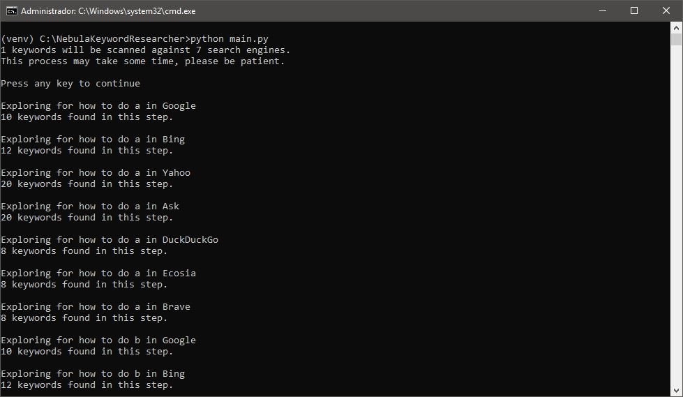
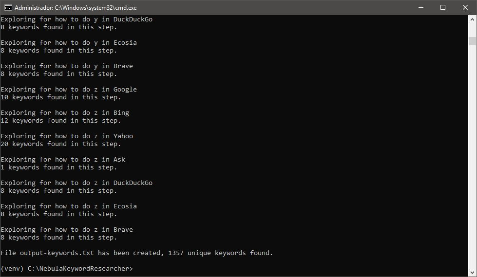

# Nebula Keyword Researcher
With Nebula Keyword Researcher you will be able to research one or more keywords and extract
new related keywords using the Suggestion APIs of Google, Bing, Yahoo!, Ask, DuckDuckgo,
Ecosia and Brave at the same time.




## Features
* 7 search engines APIS
* Low memory consumption.
* Configurable using config.ini file.
* Verbose interface.
* Output file contains just unique keywords.
* Export results to TXT.

## Installation and running 
To install and run this project copy or clone all the files to your preferred folder and type and execute:

```bash
pip install -r requirements.txt
python main.py
```
It's recommended to run in a virtual environment. 

Nebula Keyword Researcher was developed under `Python 3.10.0` it should be fine in any Python 3 environment.

## TO DO
* Make the request code async.
* GUI.
* Export keywords to other formats.
* Add Yandex and possibly other Search Engines like Amazon and eBay.
